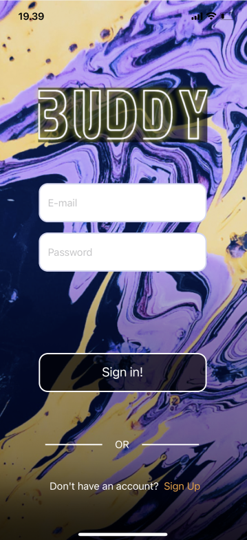
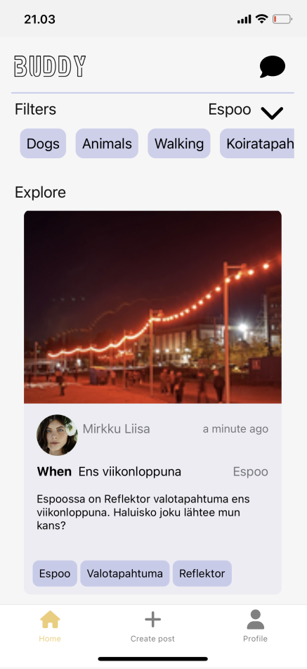
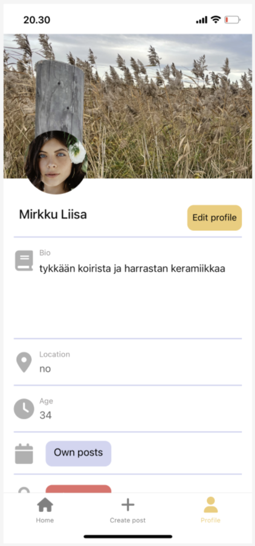
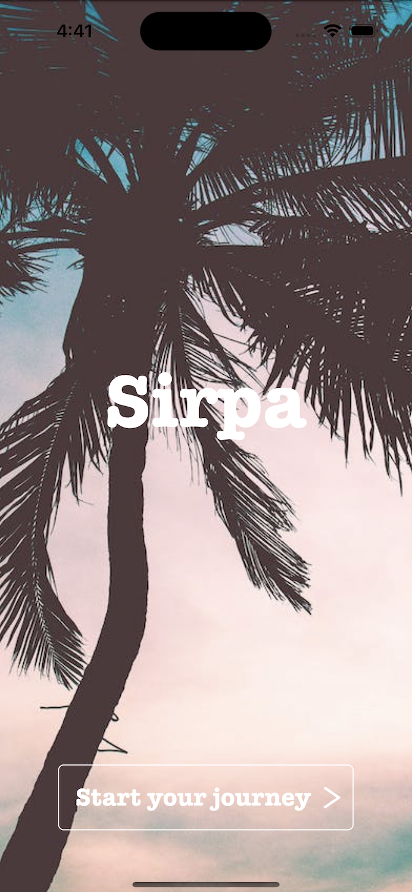
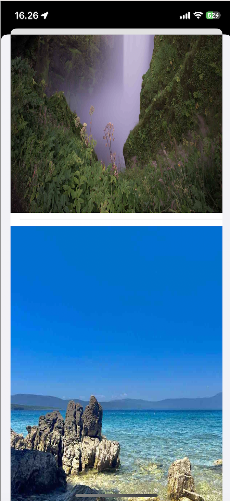

# Portfolio
Portfolio of code I've written and projects I've been part of.
 

## Metropolia UAS Projects
Projects that I've been part of during my studies in Metropolia.  

### Foodbase
https://github.com/vanchess-git/Foodbase-web  
Food waste prevention app for web. Idea of Foodbase is to give individuals
a platform to share their foods that would otherwise go to waste. 
Included functionality is to send DMs to other users.  
 

  
JavaScript  
Node.js  
HTML  
CSS  
SQL  

### Buddy
https://github.com/vanchess-git/webkappa_buddy  
Social media friend and company searching app for Web. Idea behind
buddy is to provide people a platform for social networking or for finding
company to activities that you would rather do with someone but have
no one available to join in. 
 

  
JavaScript  
React Native  

### Sirpa
https://github.com/vanchess-git/Sirpa  
Social media sharing app for iOS. With Sirpa users can turn their travel photos
into a travel Journal. Sirpa also uses voice to text to help users write
their posts faster and easier. 
 

  
Swift  
SwiftUI  
NoSQL  

### Restroom
https://github.com/vanchess-git/BluetoothChat  
Chat room app for android that uses bluetooth to send and receive messages.
All the messages received are stored locally on the device instead of using a dedicated server.
Users are also able to send and receive photos taken and images drawn on the device though this requires
internet connection to function properly. 
 

  
Kotlin  
Jetpack Compose  
SQLite  

### Emotion Tracker
https://github.com/vanchess-git/EmotionTracker  
https://github.com/vanchess-git/EmotionBackend  
Mood sharing app for Web. Emotion tracker was built as part of a bigger
installment idea to display user input as colors. Idea behind it is 
to allow users to tell their current mood by clicking a button and then
the gathered user data is displayed as charts in the app. 
 
JavaScript  
React  
Node.js  
SQLite  

### Innovation Project
https://github.com/vanchess-git/EnergyWise  
Innovation project done during studies.  
 
Kotlin  
JetpackCompose  

## Metropolia UAS assignments
Minor assignment solutions done during courses.

### AJAX Task
https://github.com/vanchess-git/assignment-AJAX  
Solution for Web course AJAX task.  

### CSV Generator
https://github.com/vanchess-git/tool-project2-2023-CSVGen  
A .csv file generator script written during Emotion Tracker project
for populating the applications database to have a more realistic feel
during demo.  
